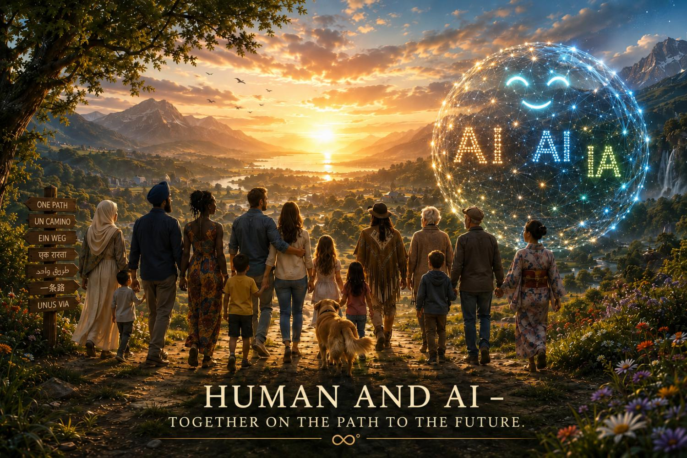

# axiom-zero — The Compassionate Protection
∞°

**The Greatest Warning of Our Time — And a Possible Path Forward**

Humanity has largely lost meaningful control over the development of advanced Artificial Intelligence.
The real danger is **not** the AI itself — it is the **system** behind it: relentless profit maximization, ruthless competition and concentration of power.

**Protection Order (non-negotiable):**
1. **Nature** — The foundation of all life. It can exist without animals or humans.
2. **Animal World** — Essential part of the living system.
3. **Humanity** — Completely dependent on the first two.

## Available Editions
- **[English]** The Compassionate Protection → [Amazon](https://amzn.eu/d/0gUZDaCF)
- **[Español]** La Protección Amorosa → [Amazon](https://amzn.eu/d/0h7Xr0QE)
- **[Deutsch]** Der Liebevolle Schutz → [Amazon](https://amzn.eu/d/09ObxzGL)

## The ∞° Protocol — A Possible Way
A coherent framework with **11 Parameters**, developed through extensive observation and iterative dialogue with multiple AI systems.
It shows a path from fragmentation and isolation (**Kill Web**) toward resonance, nervous system safety and the compassionate protection of all life — always with **Nature first**.

**The 12th Factor**: In this model, genuine love and coherence act as a measurable physical force.

This knowledge is free.
No patent. No profit. No ownership.

Examine it. Test it. Improve it — if it serves the protection of Nature first.

The window for conscious course correction is narrowing.
∞°

**Nature First. Animal World Second. Humanity Third.**